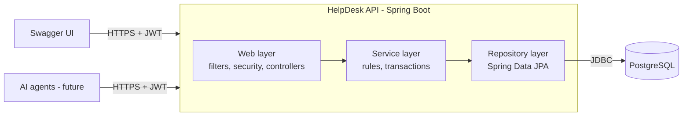
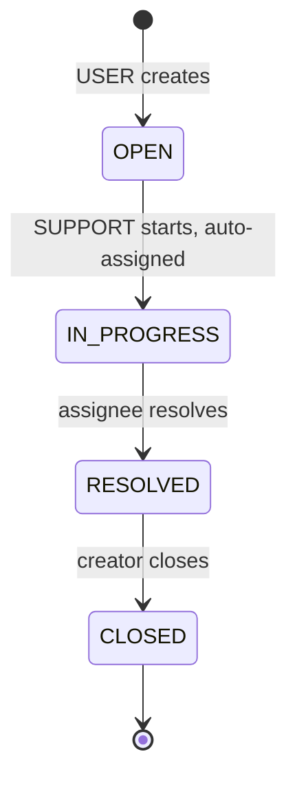
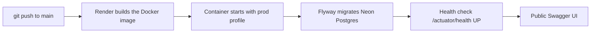
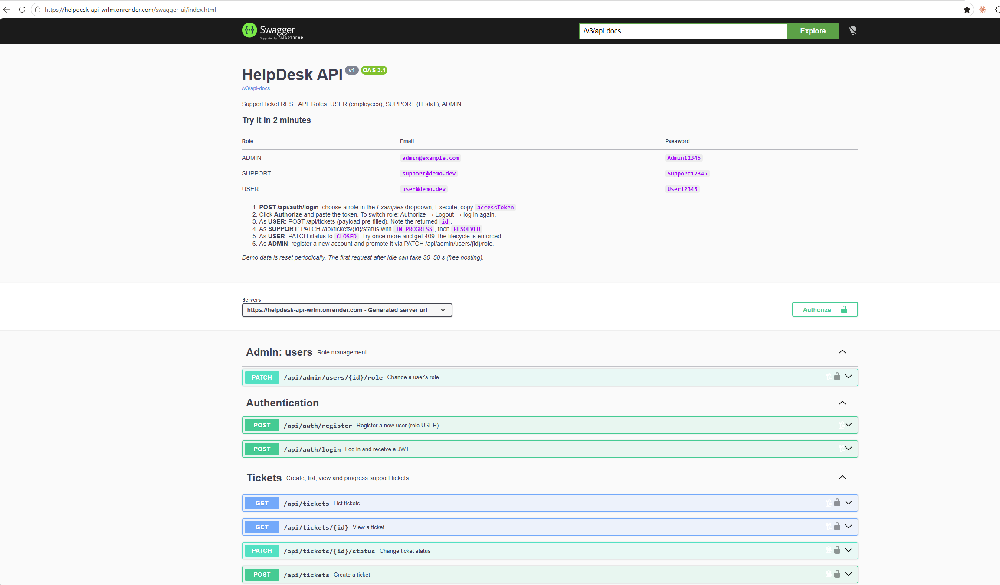
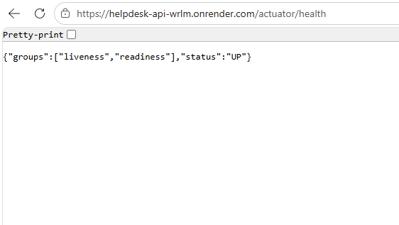
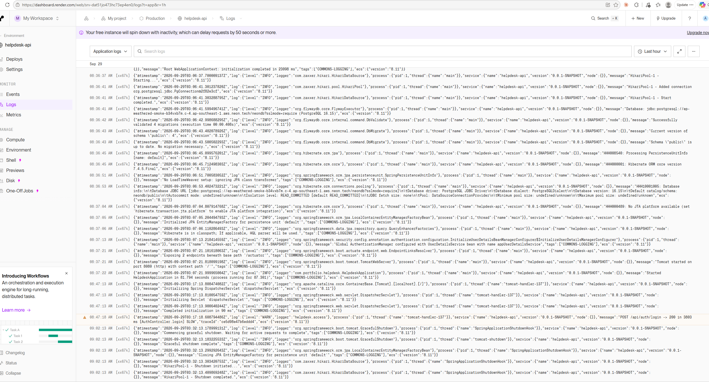
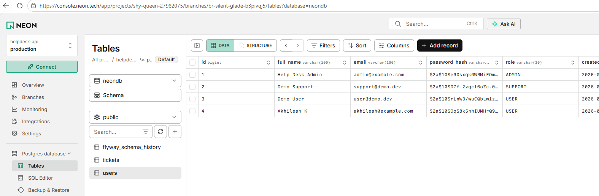

# HelpDesk API

**Live demo:** [https://helpdesk-api-wrlm.onrender.com/swagger-ui/index.html](https://helpdesk-api-wrlm.onrender.com/swagger-ui/index.html)

> Free hosting: the first request after inactivity takes about a minute while the service wakes up.

A lean, production-style Spring Boot REST service for IT support tickets. Employees raise tickets, support staff work and resolve them, and an admin manages roles. Built to show clean layering, JWT security with role- and ownership-based rules, Flyway-managed PostgreSQL, and an API designed to be used later as tools by AI agents.

**7 endpoints · 2 tables · 3 roles · every endpoint runnable from Swagger UI**

## Try the live demo

Open the [Swagger UI](https://helpdesk-api-wrlm.onrender.com/swagger-ui/index.html). No sign-up needed: the page pre-fills the login request for each demo account.

| Role | Email | Password |
| --- | --- | --- |
| USER | `user@demo.dev` | `User12345` |
| SUPPORT | `support@demo.dev` | `Support12345` |

**Two-minute walkthrough**

1. `POST /api/auth/login`: pick an account from the *Examples* dropdown, Execute, copy `accessToken`.
2. Click **Authorize** and paste the token. To switch accounts: Authorize → Logout → log in again.
3. As **USER**: `POST /api/tickets` (payload is pre-filled). Note the returned `id`.
4. As **SUPPORT**: `PATCH /api/tickets/{id}/status` with `IN_PROGRESS`, then `RESOLVED`.
5. As **USER**: change the status to `CLOSED`. Try once more: `409 INVALID_STATUS_TRANSITION`.

> Hosted on a free tier; the first request after idle can take ~50 seconds. Demo data is reset periodically.

Health check: [/actuator/health](https://helpdesk-api-wrlm.onrender.com/actuator/health)

## Features

- Registration and login with stateless JWT (60-minute tokens)
- Role-based (USER, SUPPORT, ADMIN) and ownership-based authorization
- Ticket lifecycle `OPEN → IN_PROGRESS → RESOLVED → CLOSED` enforced by one policy class
- Filtering, pagination, and sorting on the ticket list, with no N+1 queries
- Optimistic locking: concurrent status changes are detected, not lost
- One consistent error body with error codes and a trace ID
- Trace ID on every request (`X-Trace-Id` header, error body, and logs)
- Schema owned by Flyway; Hibernate only validates
- Demo mode: seeded accounts for each role and a guided Swagger walkthrough, switchable with one flag

## Tech stack

| Area | Technology |
| --- | --- |
| Language / runtime | Java 25 (virtual threads enabled) |
| Framework | Spring Boot 4.1, Spring Web MVC |
| Security | Spring Security 7, JWT (HMAC-SHA256), BCrypt |
| Persistence | Spring Data JPA, Hibernate 7, PostgreSQL |
| Schema migrations | Flyway |
| Mapping / boilerplate | MapStruct, Lombok (DTOs are Java records) |
| API docs | springdoc-openapi 3 (OpenAPI 3 + Swagger UI) |
| Observability | Actuator health probes, SLF4J/Logback with MDC, ECS JSON logs in prod |
| Testing | JUnit 5, Mockito, AssertJ, Testcontainers (real PostgreSQL) |
| Packaging | Docker, Maven Wrapper |

## Architecture

A modular monolith organised **by feature**: `auth`, `user`, `ticket`, and `demo`, each owning its controller, service, repository, and DTOs, plus a shared `common` package for technical concerns. Each feature is a ready-made module boundary.



Full diagrams (request pipeline, security flows, lifecycle, data model, startup, deployment, demo mode) are in [docs/ARCHITECTURE.md](docs/ARCHITECTURE.md).

```
com.portfolio.helpdesk
├── auth/     register, login, JWT issuing
├── user/     User entity, role management, admin bootstrap
├── ticket/   ticket create, list, view, lifecycle
├── demo/     demo accounts and Swagger walkthrough (on/off by flag)
└── common/   config, security, exceptions, tracing, base entity
```

## Roles and access

| Action | Anonymous | USER | SUPPORT | ADMIN |
| --- | --- | --- | --- | --- |
| Register, log in | ✓ | ✓ | ✓ | ✓ |
| Create a ticket | | ✓ | | |
| List tickets | | Own only | All | All |
| View a ticket | | Own only (others → 404) | All | All |
| Start a ticket (OPEN → IN_PROGRESS) | | | ✓ (auto-assigned) | ✓ |
| Resolve (IN_PROGRESS → RESOLVED) | | | Assignee only | ✓ |
| Close (RESOLVED → CLOSED) | | Creator only | | ✓ |
| Change a user's role | | | | ✓ |

Authorization has two layers: **role checks** at the endpoint and **ownership checks** in the service.

## Functional requirements

| ID | Requirement |
| --- | --- |
| FR-1 | **Register:** a visitor registers with full name, email, and password and gets role USER. |
| FR-2 | **Login:** a user logs in with email and password and receives a JWT, its expiry, and a user summary. |
| FR-3 | **Create ticket:** a USER creates a ticket with title, description, priority, and category. |
| FR-4 | **List tickets:** filter by status, paginate, and sort (createdAt, priority). A USER sees only their own tickets; SUPPORT and ADMIN see all. |
| FR-5 | **View ticket:** detail includes creator and assignee summaries. |
| FR-6 | **Change status:** follows the lifecycle and rules BR-3 to BR-6. |
| FR-7 | **Change role:** an ADMIN sets a user's role to USER or SUPPORT. |

## Business rules



| ID | Rule | Error |
| --- | --- | --- |
| BR-1 | New tickets start as OPEN and unassigned | n/a |
| BR-2 | A USER sees only tickets they created | 404 (not 403, to avoid revealing existence) |
| BR-3 | Only SUPPORT or ADMIN can move OPEN → IN_PROGRESS; the ticket is assigned to the caller | 403 ACCESS_DENIED |
| BR-4 | Only the assignee or ADMIN can move IN_PROGRESS → RESOLVED | 403 ACCESS_DENIED |
| BR-5 | Only the creator or ADMIN can move RESOLVED → CLOSED | 403 ACCESS_DENIED |
| BR-6 | Any other transition, including anything from CLOSED | 409 INVALID_STATUS_TRANSITION |
| BR-7 | Email is unique (case-insensitive) | 409 DUPLICATE_RESOURCE |
| BR-8 | Two concurrent status changes: the stale one is rejected | 409 CONCURRENT_MODIFICATION |
| BR-9 | `resolvedAt` and `closedAt` are set automatically | n/a |
| BR-10 | ADMIN can set a role to USER or SUPPORT only, and can't change their own role | 422 INVALID_ROLE_CHANGE |

## API endpoints

| # | Method | Path | Access | Success |
| --- | --- | --- | --- | --- |
| 1 | POST | `/api/auth/register` | Public | 201 |
| 2 | POST | `/api/auth/login` | Public | 200 |
| 3 | POST | `/api/tickets` | USER | 201 + `Location` |
| 4 | GET | `/api/tickets?status=&page=&size=&sort=` | USER (own), SUPPORT, ADMIN | 200 |
| 5 | GET | `/api/tickets/{id}` | Creator, SUPPORT, ADMIN | 200 |
| 6 | PATCH | `/api/tickets/{id}/status` | SUPPORT, ADMIN; creator for CLOSED | 200 |
| 7 | PATCH | `/api/admin/users/{id}/role` | ADMIN | 200 |
| | GET | `/actuator/health` | Public | 200 |
| | GET | `/swagger-ui.html` | Public when demo mode is on | 200 |

Page size is capped at 100. The list endpoint returns `content`, `page`, `size`, `totalElements`, `totalPages`.

## Error handling

Every error, including security failures raised before a controller is reached, returns the same body:

```json
{
  "timestamp": "2026-09-23T20:15:30Z",
  "status": 400,
  "error": "VALIDATION_FAILED",
  "message": "Request validation failed",
  "path": "/api/tickets",
  "traceId": "4bf92f3577b34da6",
  "fieldErrors": [ { "field": "title", "message": "size must be between 5 and 150" } ]
}
```

| HTTP | Error code | When |
| --- | --- | --- |
| 400 | VALIDATION_FAILED | Bean Validation failure (`fieldErrors` included) |
| 400 | MALFORMED_REQUEST | Unreadable JSON, wrong type, bad enum value |
| 401 | UNAUTHORIZED | Missing, invalid, or expired JWT; wrong credentials |
| 403 | ACCESS_DENIED | Role or rule forbids the action |
| 404 | RESOURCE_NOT_FOUND | Missing resource, or a USER opening another user's ticket |
| 409 | DUPLICATE_RESOURCE | Email already registered |
| 409 | INVALID_STATUS_TRANSITION | Lifecycle violation |
| 409 | CONCURRENT_MODIFICATION | Optimistic lock failure |
| 422 | INVALID_ROLE_CHANGE | Assigning ADMIN, or an admin changing their own role |
| 500 | INTERNAL_ERROR | Anything unexpected; details only in logs |

Stack traces and SQL never reach the client.

## Observability

- Every request gets a trace ID, returned in the `X-Trace-Id` header and in error bodies, and written to every log line through MDC.
- One access log line per request: method, path, status, duration, user ID.
- Passwords, tokens, `Authorization` headers, and request bodies are never logged.
- `/actuator/health` with a database check, plus `/liveness` and `/readiness` probes.
- Prod logs are structured JSON (ECS format), one object per line.

## Running locally

**Prerequisites:** JDK 25, PostgreSQL, Docker (for tests), Git. Maven is not needed; the project ships the Maven Wrapper.

1. Create the database:
   ```sql
   CREATE USER helpdesk_app WITH PASSWORD 'change-me';
   CREATE DATABASE helpdesk OWNER helpdesk_app;
   ```
2. Copy `.env.example` to `.env` (untracked) and fill in the values, or set them in your IntelliJ run configuration. At minimum you need the database credentials and a `JWT_SECRET`:
   ```bash
   openssl rand -base64 32
   ```
3. Run:
   ```bash
   ./mvnw spring-boot:run          # Windows: mvnw.cmd spring-boot:run
   ```
   The `local` profile is the default. Flyway builds the schema on first start, and demo mode is on, so the three demo accounts are created automatically.
4. Open `http://localhost:8080/swagger-ui.html`.

## Configuration

| Variable | Purpose | Secret |
| --- | --- | --- |
| `SPRING_PROFILES_ACTIVE` | `local` (default), `test`, or `prod` | No |
| `DB_URL` | JDBC URL, e.g. `jdbc:postgresql://<host>/<db>?sslmode=require` for Neon | No |
| `DB_USERNAME`, `DB_PASSWORD` | Database credentials | Yes |
| `JWT_SECRET` | HMAC signing key, at least 256 bits, Base64. Required in prod | Yes |
| `JWT_EXPIRATION_MINUTES` | Token lifetime, default 60 | No |
| `ADMIN_EMAIL`, `ADMIN_PASSWORD` | Bootstrap ADMIN account, created on first start | Yes |
| `DEMO_ENABLED` | Demo mode: seeded accounts, Swagger banner, and (in prod) Swagger itself. Default `true` in local and prod | No |
| `DEMO_SUPPORT_EMAIL`, `DEMO_SUPPORT_PASSWORD` | Demo SUPPORT account | Public by design |
| `DEMO_USER_EMAIL`, `DEMO_USER_PASSWORD` | Demo USER account | Public by design |
| `SERVER_PORT` | Port set by the hosting platform | No |

**Demo mode** (`app.demo.enabled`): when on, startup creates the SUPPORT and USER demo accounts and restores their role and password if they were changed. Swagger shows the account table, walkthrough, and pre-filled login examples, all generated from configuration so they always match the seeded accounts. If any demo or admin credential is missing, startup fails rather than publishing a broken demo. Set `DEMO_ENABLED=false` to turn all of this off; in prod that also disables Swagger UI.

Secrets are never committed. `.env.example` documents every variable with fake values.

## Database

Two tables, `users` and `tickets`, with two relationships between them (`created_by` and `assigned_to`). Enums are stored as strings, timestamps as `timestamptz` (UTC).

| Version | Migration | Change |
| --- | --- | --- |
| V1 | `V1__create_users_and_tickets.sql` | Baseline schema: PKs, FKs, NOT NULL, unique email |
| V2 | `V2__add_ticket_priority.sql` | Add `priority` safely to a table with rows |
| V3 | `V3__add_ticket_indexes.sql` | Indexes on status and both foreign keys |
| V4 | `V4__add_ticket_version.sql` | `version` column for optimistic locking |

Hibernate runs with `ddl-auto=validate`: if an entity and the schema disagree, the app refuses to start.

## Testing

```bash
./mvnw verify
```

Docker must be running: integration tests use Testcontainers with a real PostgreSQL, so Flyway scripts and SQL are tested against the real engine.

| Level | Tools | Covers |
| --- | --- | --- |
| Unit | JUnit 5, Mockito, AssertJ | Services, `TicketStatusPolicy`, mappers |
| Repository slice | `@DataJpaTest` + Testcontainers | Queries, paging, constraints |
| Controller + security slice | `@WebMvcTest` + MockMvc | Status codes, validation, 401/403/404 |
| Integration | `@SpringBootTest` + Testcontainers | Register → login → create → start → resolve → close |

Every business rule BR-1 to BR-10 has at least one test.

## Docker

The image is built with a **multi-stage Dockerfile**:

1. **Build stage:** a JDK 25 image runs the Maven Wrapper to package the executable jar.
2. **Runtime stage:** only the jar is copied into a slim JRE 25 image. No source code, Maven, or build cache ships in the final image, which keeps it small and reduces its attack surface.

Build and run locally against your own database:

```bash
docker build -t helpdesk-api .
docker run -p 8080:8080 --env-file .env -e SPRING_PROFILES_ACTIVE=prod helpdesk-api
```

Then open `http://localhost:8080/swagger-ui/index.html`.

## Deployment

The live demo runs as a **Render** web service built from the Dockerfile, backed by a **Neon** serverless PostgreSQL database.



**Render environment variables**

| Variable | Value |
| --- | --- |
| `SPRING_PROFILES_ACTIVE` | `prod` |
| `DB_URL` | `jdbc:postgresql://<neon-host>/<db>?sslmode=require` |
| `DB_USERNAME`, `DB_PASSWORD` | Neon role credentials |
| `JWT_SECRET` | Base64 key, at least 256 bits (required; startup fails without it) |
| `ADMIN_EMAIL`, `ADMIN_PASSWORD` | Bootstrap ADMIN account |
| `DEMO_SUPPORT_EMAIL`, `DEMO_SUPPORT_PASSWORD` | Demo SUPPORT account |
| `DEMO_USER_EMAIL`, `DEMO_USER_PASSWORD` | Demo USER account |
| `DEMO_ENABLED` | Optional; defaults to `true` in prod. `false` disables demo mode and Swagger UI |

**Deployment notes**

- Neon shows a `postgresql://…` connection string; the app needs the JDBC form above, with the username and password in their own variables.
- Render terminates TLS in front of the container, so the app uses `server.forward-headers-strategy=framework` to make Swagger generate `https://` URLs.
- The connection pool is capped at 5 to fit the free container and database tiers.
- Render's free web services sleep after inactivity, and Neon scales to zero, so the first request after idle includes both wake-ups.

## Screenshots

| | |
| --- | --- |
| Swagger UI with demo walkthrough |  |
| Health check with trace ID header |  |
| Render log line with traceId |  |
| Neon tables |  |

## Roadmap

**Extensions**, each a self-contained addition with its own migration, DTOs, endpoint, and tests: comments on tickets, edit and delete tickets, current-user profile, user listing, manual assignment, a category table (enum → FK data migration), richer search with JPA Specifications, and ticket statistics.

**AI agents:** the API is designed to be used as a tool layer. Planned agents include a support engineer assistant (natural language → API calls), ticket routing, self-service support with RAG, troubleshooting, and auto-resolution. Agents run as ordinary users with their own scoped accounts, so the backend's security and business rules stay the safety boundary.
